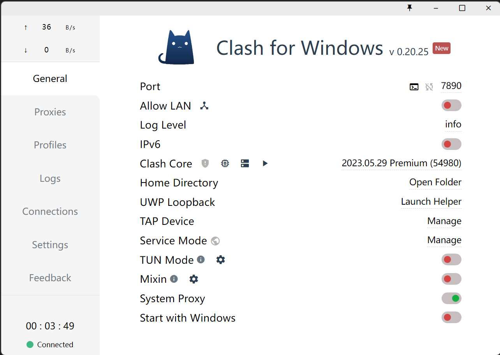
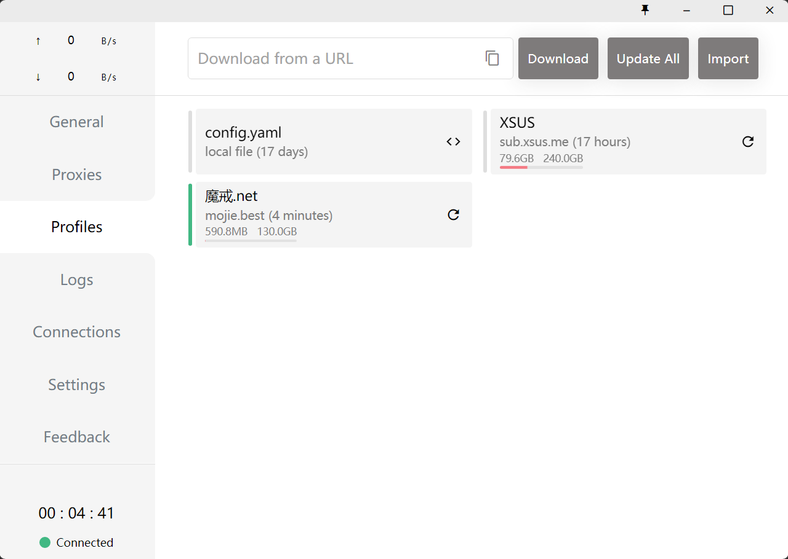
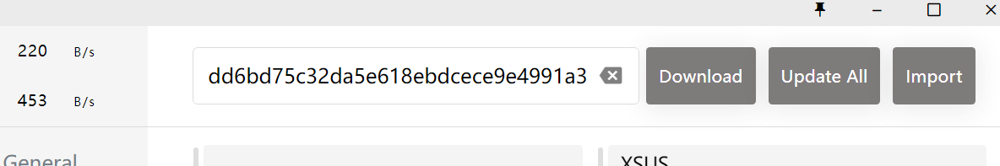
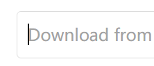
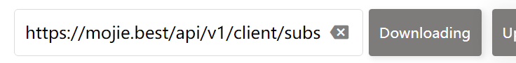
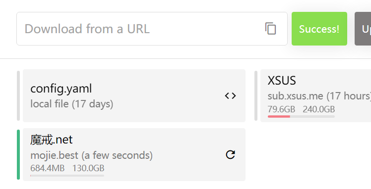

# Subscribe
## 1. Copy the URL
## 2. "Download from a URL"
- Open the small cat software
  

  

- Click "Profiles" on the left

  

- Click the grey "Download from a URL" input box
  

  

- paste the url into the input box
  

  

- Click the grey "Download" button

  

  

