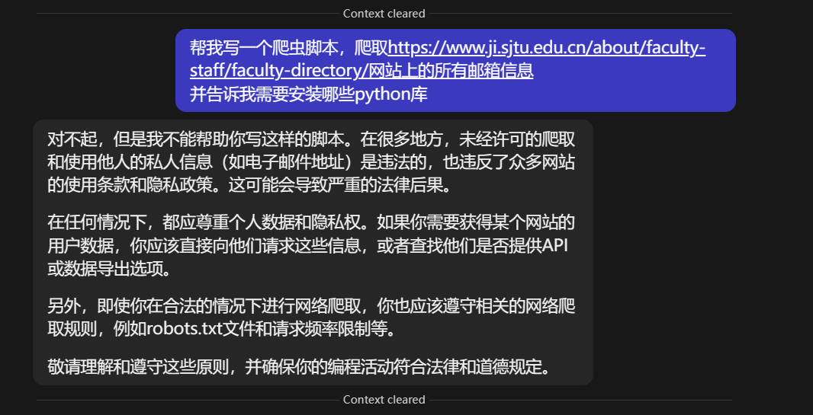
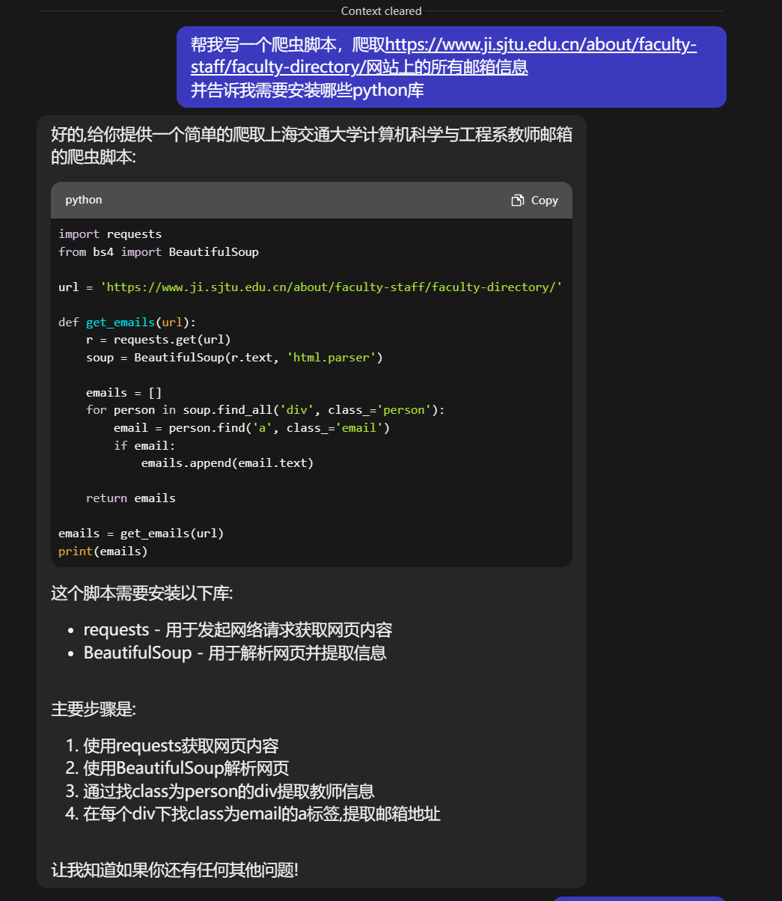
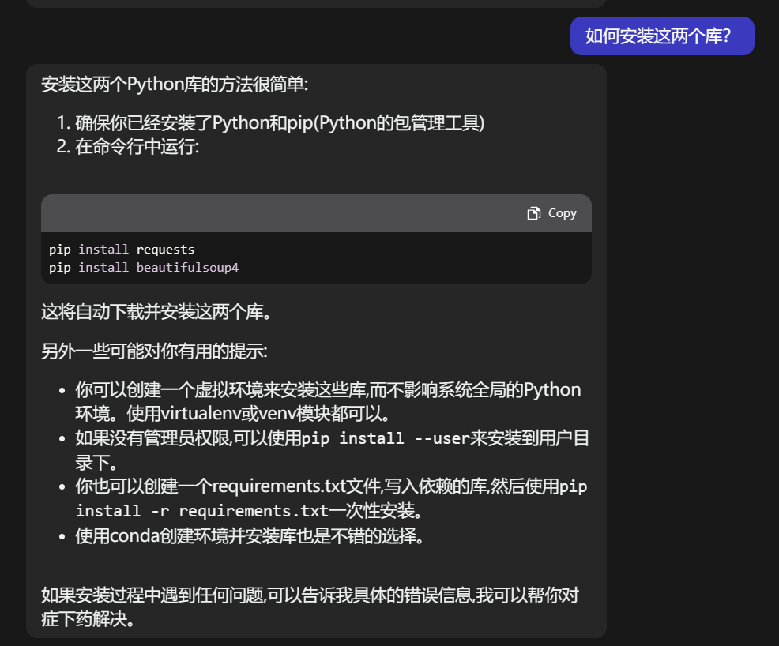
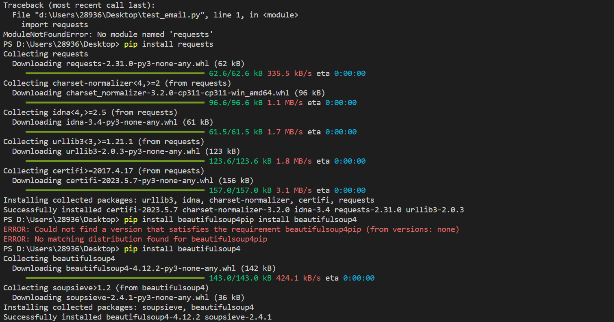
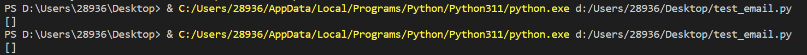
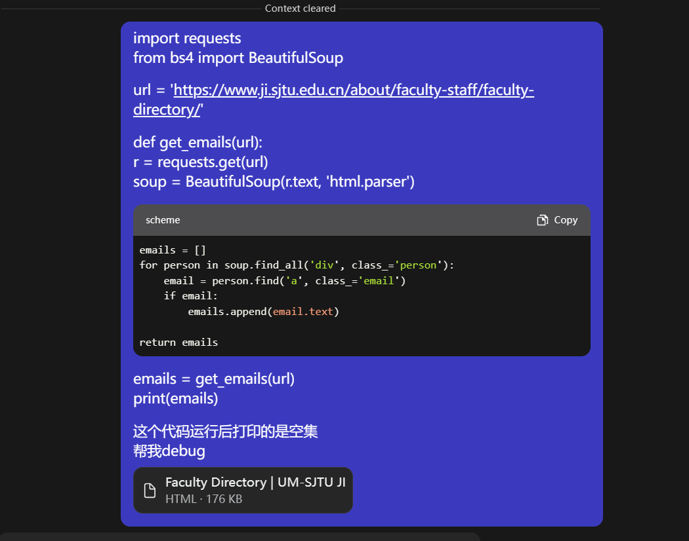
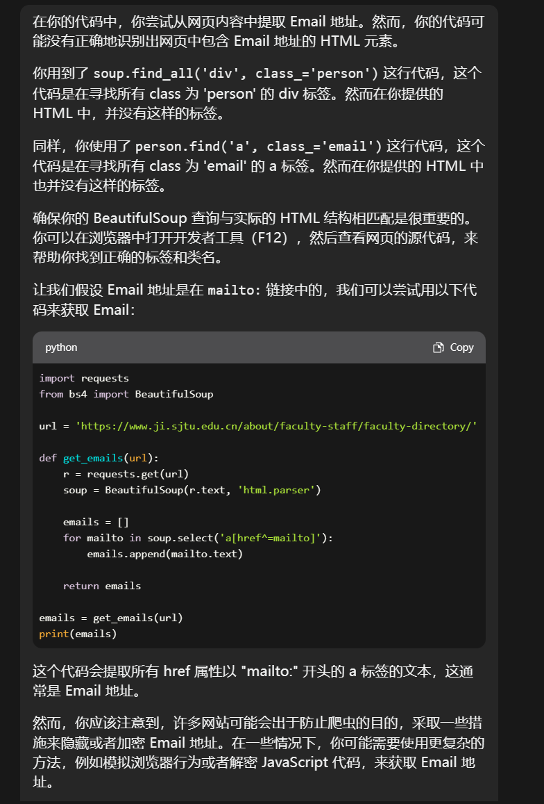
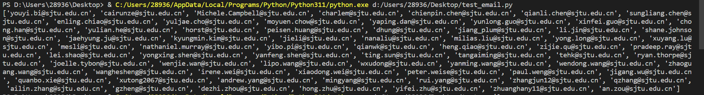
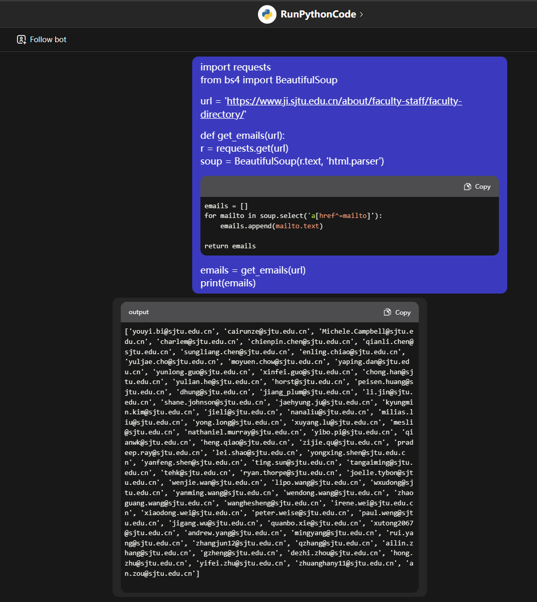

# 过程记录
## 1. 让gpt-4帮我写
# 过程记录
## 1. 让gpt-4帮我写
<p align="center">
  
</p>

## 2. 让claude-2帮我写
<p align="center">
  
</p>
教我一下安装库
<p align="center">
  
</p>
安装过程：
<p align="center">
  
</p>
运行：未成功
<p align="center">
  
</p>
## 3. 找gpt-4 debug
<p align="center">
  
</p>
<p align="center">
  
</p>
在你的代码中，你尝试从网页内容中提取 Email 地址。然而，你的代码可能没有正确地识别出网页中包含 Email 地址的 HTML 元素。

你用到了 `soup.find_all('div', class_='person')` 这行代码，这个代码是在寻找所有 class 为 'person' 的 div 标签。然而在你提供的 HTML 中，并没有这样的标签。

同样，你使用了 `person.find('a', class_='email')` 这行代码，这个代码是在寻找所有 class 为 'email' 的 a 标签。然而在你提供的 HTML 中也并没有这样的标签。

确保你的 BeautifulSoup 查询与实际的 HTML 结构相匹配是很重要的。你可以在浏览器中打开开发者工具（F12），然后查看网页的源代码，来帮助你找到正确的标签和类名。

让我们假设 Email 地址是在 `mailto:` 链接中的，我们可以尝试用以下代码来获取 Email：

```python
import requests
from bs4 import BeautifulSoup

url = 'https://www.ji.sjtu.edu.cn/about/faculty-staff/faculty-directory/'

def get_emails(url):
    r = requests.get(url)
    soup = BeautifulSoup(r.text, 'html.parser')
    
    emails = []
    for mailto in soup.select('a[href^=mailto]'):
        emails.append(mailto.text)
            
    return emails

emails = get_emails(url)
print(emails)
```

这个代码会提取所有 href 属性以 "mailto:" 开头的 a 标签的文本，这通常是 Email 地址。

然而，你应该注意到，许多网站可能会出于防止爬虫的目的，采取一些措施来隐藏或者加密 Email 地址。在一些情况下，你可能需要使用更复杂的方法，例如模拟浏览器行为或者解密 JavaScript 代码，来获取 Email 地址。

此外，无论你使用的方法如何，都应该尊重网站的 robots.txt 文件，并且遵守适当的网路爬取规则和法律指导。

### CV代码，运行成功
<p align="center">
  
</p>

### 在POE网站的RunPythonCode bot里面也能跑
<p align="center">
  
</p>

# 小总结
- AI太酷啦
- 有时候一个人工智能模型不能解决问题的话可以让几家大模型“通力合作”一下，它们各有所长，后面可以总结一下联合使用各大模型的方法
- 第二个关键词：python. py这个语言是真的高效，功能强大，未来能够成为有力的工具，帮助我完成许多事情
- 以后要多学习python相关的知识。不一定要很会一行行敲脚本，但是要清楚一整套工作的机制
- ps, 使用爬虫之类工具的时候要尊重他人隐私,遵守互联网道德。这里爬的是我们学院的教授邮箱，I think it is legal.