记录了git最基础的配置
希望能帮到小伙伴们
大佬自行跳过


# 注册github账号

# 下载git

## 官网下载
1. 进入官网[https://git-scm.com/](https://git-scm.com/)

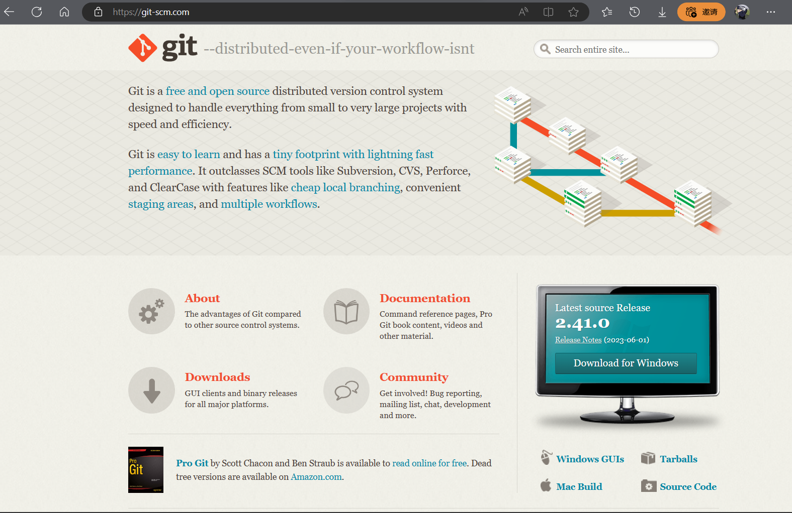


2. Download for Windows

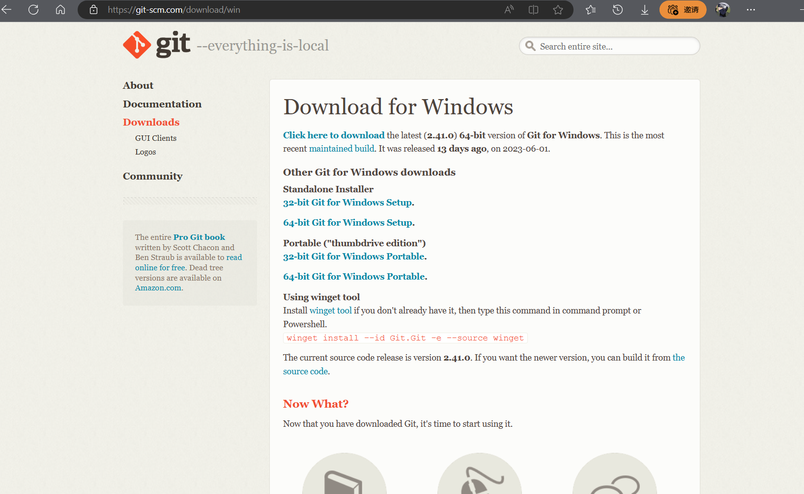

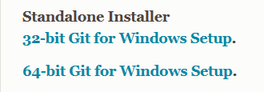

3. 根据自己的电脑型号下载安装包，大部分电脑点击64-bit Git for Windows Setup<br>
等下载就好了<br>
有时候会有点慢
要是太慢等不及的话跟着这个教程下载镜像：[王佳斌 git官网下载太慢解决方法](https://blog.csdn.net/weixin_44198965/article/details/99686507)

## 安装
1. 下载下来是一个安装包，点击安装

2. Next Next Next ... Install
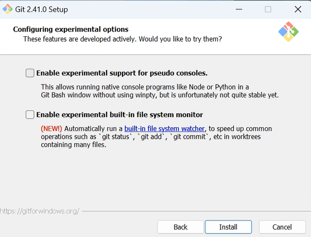
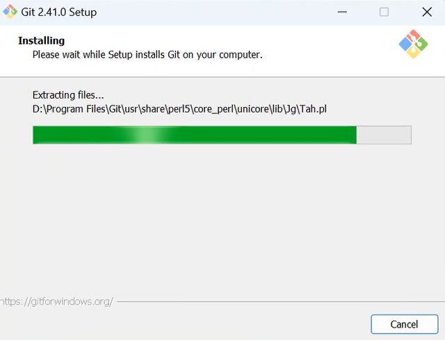
3. Finish
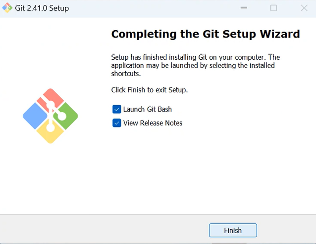
上面一个勾勾上会出现git的命令行终端界面，后面我们会在这个终端里面输入一些git的命令
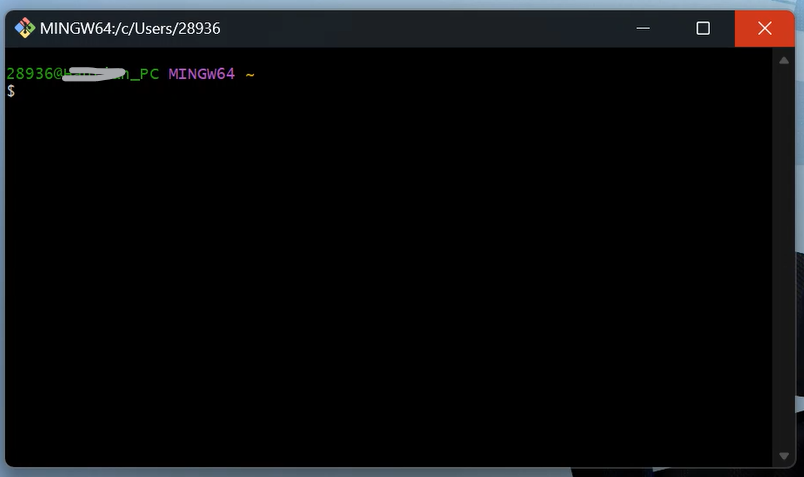
下面一个勾勾上会出现Release Notes页面，一般不用管
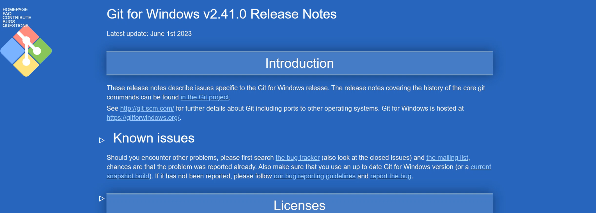
4. 检查是否安装成功
打开终端，输入`git -v`命令查看是否安装成功<br>
出现version编号说明安装成功


# 基础配置

1. 配置用户名和邮箱
打开git终端，输入命令
```
git config --global user.name "Your Name"

Your Name 填自己的用户名，

回车，输入下面命令配置邮箱
邮箱最好用github注册相同的邮箱

git config --global user.email "Your Email"
```

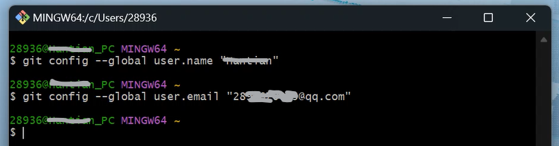

2. 配置ssh密钥（重要，本人笨蛋刚开始配置git的时候总在这里出问题【敲打】）
```
$ cd ~

进入家目录


$ mkdir .ssh

创建.ssh的隐藏文件夹


$ ssh-keygen -t rsa -C "your_email@example.com"

your_email@example.com替换为 GitHub 电子邮件地址


后面点Enter就好
```


3. 打开密钥文件
```
$ ls 

查看该目录下的文件


$ cat id_rsa.pub

打开查看公钥文件

```
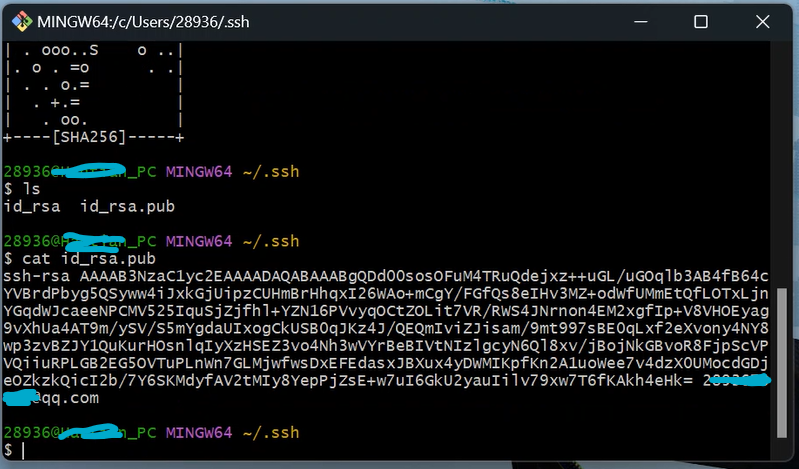

4. 将 SSH 公钥添加到 GitHub 上的帐户<br>
复制公钥，注意从 ssh-rsa 开始一直复制到最后邮箱的结尾<br>
打开 gitbub<br>
在页面的右上角，单击个人资料照片，然后单击“settings”<br>
在边栏的“访问”部分中，单击 “SSH 和 GPG 密钥”。<br>
单击“新建 SSH 密钥”或“添加 SSH 密钥” 。<br>
在 "Title"（标题）字段中，为新密钥添加描述性标签。 例如，如果使用的是个人笔记本电脑，则可以将此密钥称为“个人笔记本电脑”。<br>


5. 点击 Add SSH key, 添加成功
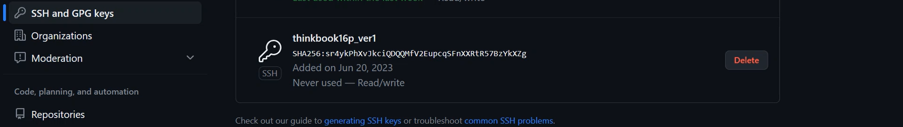


# 基础操作

## 克隆仓库

1. 将github上的远程仓库克隆的本地<br>

点击绿色按钮 Code<br>
选择SSH<br>

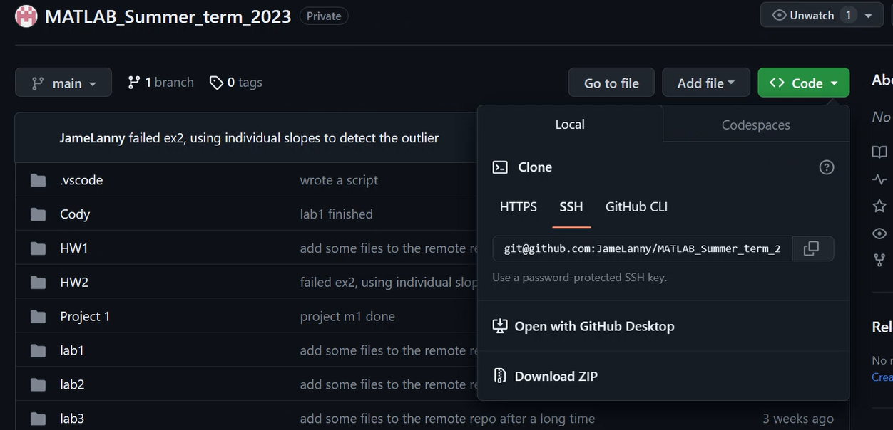

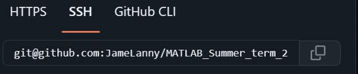

2. 复制这个网址<br>

打开终端 (git终端或者windows终端都行)<br>
（如这里是在桌面右键，在终端中打开）<br>

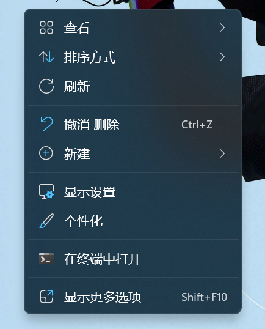

在终端中输入 git clone 加 刚才网址
```
$ git clone git@github.com:JameLanny/C_Summer_term2023.git

这里 clone 后面的参数网址只是我的示例，应该替换成你要克隆的仓库的地址
```
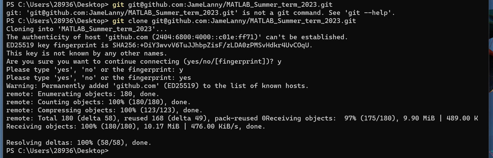

这个时候打开终端的那个文件见会多出一个文件夹了

## add commit push

在本地仓库里新建一个test.txt
打开命令行终端

```
git add .

当前目录下修改的所有代码从工作区添加到暂存区


git commit -m "comments"

引号里填写这次提交的注释
将缓存区内容添加到本地仓库


git push 

将本地版本库的分支推送到远程服务器上对应的分支
```


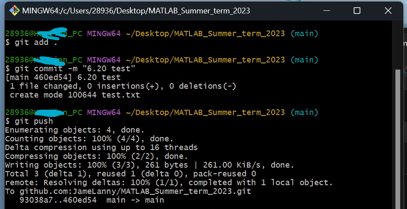